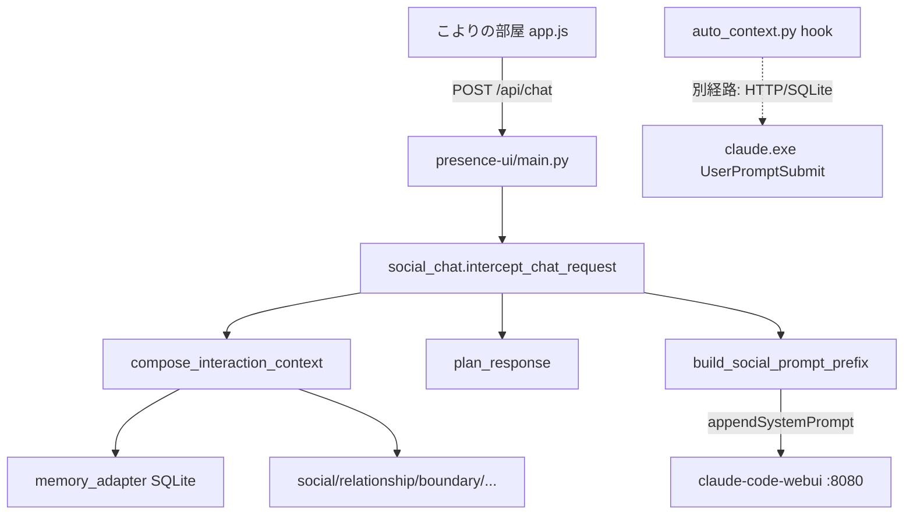

# ミッションA 調査報告：記憶統合の現状

**進行経路**: 直接調査（単純なコード探索タスクのためサブエージェント未使用）

---

## 1. コンテキスト構築処理の特定

### 中核実装

| 層 | ファイル | 関数 |
|---|---|---|
| **コア** | `sociality-mcp/packages/interaction-orchestrator-mcp/src/interaction_orchestrator_mcp/compose.py` | `compose_interaction_context()` |
| **スキーマ** | `.../interaction_orchestrator_mcp/schemas.py` | `ComposeInteractionContextInput`, `InteractionContext` |
| **MCP 公開** | `sociality-mcp/src/sociality_mcp/server.py` | `compose_interaction_context_tool()` |
| **HTTP** | 同上 `server.py` | `GET /interaction_context`（フック連携用） |

`compose_interaction_context()` は複数ストアから情報を集め、最後に `InteractionContext` を返す。

```114:129:sociality-mcp/packages/interaction-orchestrator-mcp/src/interaction_orchestrator_mcp/compose.py
    memory = memory_adapter or make_default_memory_adapter()
    relevant_memories = [
        RelevantMemoryRef(
            memory_id=hit.memory_id,
            content=hit.content,
            relevance=hit.relevance,
            use_policy=hit.use_policy,
            reason=hit.reason,
        )
        for hit in memory.recall_for_response(
            user_text=payload.user_text,
            person_id=payload.person_id,
            max_results=6,
            include_private=payload.include_private,
        )
    ]
```

### 呼び出し元（本番フロー）

#### A. こよりの部屋（:8090）— **現行メインパス**

```
POST /api/chat
  → presence-ui/src/presence_ui/main.py (post_chat)
  → presence-ui/src/presence_ui/gateway/social_chat.py (intercept_chat_request)
  → compose_interaction_context + plan_response
  → build_social_prompt_prefix → appendSystemPrompt
  → proxy to claude-code-webui (:8080)
```

```65:115:presence-ui/src/presence_ui/gateway/social_chat.py
def intercept_chat_request(*, payload: dict, person_id: str = "ma") -> ChatInterceptResult:
    """Run compose/plan; enrich message or block forward on silent moves."""
    ...
    ctx = compose_interaction_context(
        ComposeInteractionContextInput(
            person_id=person_id,
            channel="chat",
            user_text=message,
            session_id=session_key,
            include_private=True,
            max_chars=10000,
        ),
        social_state_store=stores.social_state,
        ...
    )
    plan = plan_response(PlanResponseInput(interaction_context=ctx, user_text=message))
    ...
    prefix = build_social_prompt_prefix(ctx=ctx, plan=plan)
    enriched = payload.copy()
    enriched["message"] = message
    if prefix:
        enriched["appendSystemPrompt"] = prefix
```

プロンプト注入は `presence-ui/src/presence_ui/services/llm.py` の `build_social_prompt_prefix()`。

#### B. レガシー LM Studio 直叩きパス

- `presence-ui/src/presence_ui/services/interact.py` — `handle_chat_send()` / `_compose_and_plan()`
- **現行 `main.py` からはルートされていない**（テスト `test_interact.py`, `test_session_context.py` のみ）

#### C. その他

| 呼び出し元 | 用途 |
|---|---|
| `sociality-mcp/src/sociality_mcp/server.py` | MCP ツール `compose_interaction_context_tool` |
| 同上 | `get_agent_state`（軽量版、内部で compose） |
| 同上 | HTTP `GET /interaction_context` |
| `benchmarks/human_response/run_suite.py` | ベンチマーク |
| `.claude/commands/talk.md` | Claude Code CLI 手動フロー |

### データフロー図



---

## 2. `mcp__memory__recall` の利用状況

### 結論：**compose / チャット応答フローの Python コードでは一度も使われていない**

`mcp__memory__recall` が出てくるのはドキュメント・スキルのみ:

- `.claude/commands/talk.md`, `memories.md`, `recover-from-compact.md`
- `CLAUDE.md`, `SOUL.md.example`
- `test-autonomous.sh`（手動テスト手順）

### 実際に使われている記憶想起

| 経路 | 実装 | 方式 |
|---|---|---|
| **compose 内** | `memory_adapter.py` → `SQLiteMemoryAdapter.recall_for_response()` | `memory.db` 直読み + **LIKE キーワード** |
| **Claude Code フック** | `.claude/hooks/auto_context.py` | HTTP `:18900/recall` → 失敗時 SQLite フォールバック |
| **LLM エージェント** | `memory-mcp` の MCP ツール `recall` | `MemoryStore.recall()` — **セマンティック + Hopfield** |

`memory-mcp` の本物 `recall` は `memory-mcp/src/memory_mcp/store.py` の `MemoryStore.recall()`（ベクトル検索 + Hopfield ブレンド）。compose の adapter はこれを**呼んでいない**。

```736:762:memory-mcp/src/memory_mcp/store.py
    async def recall(self, context: str, n_results: int = 3) -> list[MemorySearchResult]:
        """Recall using hybrid semantic + Hopfield scoring."""
        pool_size = min(n_results * 3, 20)
        scored_results = await self.search_with_scoring(
            query=context, n_results=pool_size, use_time_decay=True, use_emotion_boost=True
        )
        ...
```

### 重要な含意

作戦メモの「`compose` に `mcp__memory__recall` を組み込む」は、**配線は既にあるが品質が別物**という状態。

- **配線済み**: `relevant_memories` → `compact_prompt_block` の `[relevant_memories]` セクション → `appendSystemPrompt`
- **未統合**: memory-mcp のセマンティック recall ロジック
- **二重経路**: キオスクチャットでは hook（`:18900`）と compose（SQLite LIKE）が**別々**に動く

---

## 3. `InteractionContext` のデータ構造

定義: `sociality-mcp/packages/interaction-orchestrator-mcp/src/interaction_orchestrator_mcp/schemas.py`

### 入力 `ComposeInteractionContextInput`

| キー | 型 | 既定 |
|---|---|---|
| `person_id` | `str \| None` | `"ma"` |
| `channel` | `"chat" \| "voice" \| ...` | `"chat"` |
| `user_text` | `str \| None` | — |
| `autonomous_trigger` | `str \| None` | — |
| `session_id` | `str \| None` | — |
| `session_history` | `list[SessionTurn]` | `[]` |
| `include_private` | `bool` | `True` |
| `max_chars` | `int` | `3000`（キオスクは `10000`） |

### 出力 `InteractionContext`（主要フィールド）

| キー | 型 | 内容 |
|---|---|---|
| `ts`, `local_time`, `timezone` | `str` | タイムスタンプ |
| `person_id`, `person_name` | `str \| None` | 相手 |
| `session_id` | `str \| None` | CC セッション ID |
| `session_history` | `list[SessionTurn]` | `{sender, text, timestamp, message_id}` |
| `session_context_block` | `str` | 部屋会話の整形テキスト |
| `social_state` | `dict` | 在席・活動・フェーズ等 |
| `turn_taking` | `dict` | ターン状態 |
| `boundary_hints` | `list[str]` | 境界ヒント |
| `person_model` | `dict \| None` | 関係モデル（Mission C 対象） |
| `open_loops` | `list[OpenLoopSummary]` | 未解決ループ |
| `commitments_due` | `list[CommitmentSummary]` | 約束 |
| `suggested_followups` | `list[FollowupSuggestion]` | フォローアップ提案 |
| `self_summary` | `dict \| None` | 自己要約 |
| `active_arcs` | `list[dict]` | narrative arc |
| `latest_daybook` | `str \| None` | 日次要約 |
| `desire_state` | `dict \| None` | 欲求スナップショット（Mission B） |
| `agent_state` | `AgentStateSummary` | 欲求・体験・解釈シフト数等 |
| **`relevant_memories`** | **`list[RelevantMemoryRef]`** | **記憶（Mission A 核心）** |
| `recent_experiences` | `list[RecentExperienceRef]` | 直近体験 |
| `joint_focus` | `dict \| None` | 共同注意 |
| `current_scene_summary` | `str \| None` | シーン要約 |
| `response_contract` | `ResponseContract` | 応答契約 |
| `prompt_summary` | `str` | 1行要約（記憶件数含む） |
| **`compact_prompt_block`** | **`str`** | **プロンプト注入用ブロック** |

### `RelevantMemoryRef`

```97:104:sociality-mcp/packages/interaction-orchestrator-mcp/src/interaction_orchestrator_mcp/schemas.py
class RelevantMemoryRef(BaseModel):
    memory_id: str | None = None
    content: str
    relevance: float = Field(ge=0.0, le=1.0)
    use_policy: Literal["mentionable", "background_only", "do_not_surface"] = "background_only"
    reason: str | None = None
```

### プロンプトへの反映経路

1. **`compact_prompt_block`** — `[relevant_memories]` に最大 mentionable 3件 + background 2件（120/80文字トリム）

```541:573:sociality-mcp/packages/interaction-orchestrator-mcp/src/interaction_orchestrator_mcp/compose.py
    memory_lines: list[str] = []
    mentionable = [m for m in relevant_memories if m.use_policy == "mentionable"]
    background = [m for m in relevant_memories if m.use_policy == "background_only"]
    for m in mentionable[:3]:
        snippet = m.content[:120] + ("…" if len(m.content) > 120 else "")
        memory_lines.append(f"[mentionable r={m.relevance:.2f}] {snippet}")
    ...
    if memory_lines:
        sections.append("[relevant_memories]")
        sections.extend(memory_lines)
```

2. **`plan_response`** — `memory_use.use_specific_memory` を `mentionable` の有無で切替

3. **`build_social_prompt_prefix`** — `compact_prompt_block` を `[Social context]` として `appendSystemPrompt` に載せる

---

## 4. 設計への移行：どこをどう直すか

### 現状ギャップ（なぜ「あの時こう言ったね」が出にくいか）

| 問題 | 詳細 |
|---|---|
| **想起品質** | compose は LIKE キーワードのみ。短い発話・言い換え・関連語ではヒットしない |
| **MCP 未使用** | `mcp__memory__recall` は LLM が手動で呼ぶ前提。キオスクは自動注入のみ |
| **DB パス不一致の可能性** | adapter: `MEMORY_DB_FILE`、hook: `MEMORY_DB_PATH`（既定は同じだが env 名が別） |
| **記憶が少ない** | 過去の sanitize で `memory.db` がほぼ空の状態だった |
| **hook と compose の分離** | hook は Claude Code セッション向け、compose は presence-ui 向け。統合されていない |

### 推奨修正方針（Mission A）

**方針A（推奨）: `memory_adapter` に HttpMemoryAdapter を追加**

`ORCHESTRATOR_MEMORY_BACKEND=http` を追加し、`http://127.0.0.1:18900/recall?q=...` を呼ぶ。memory-mcp のセマンティック recall と compose を同一ロジックに揃える。MCP stdio を in-process で呼ぶより軽く、既存 HTTP エンドポイントを再利用できる。

変更箇所:
1. `sociality-mcp/.../memory_adapter.py` — `HttpMemoryAdapter` 追加、`make_default_adapter()` の `auto` を「HTTP 応答 → SQLite → null」に
2. `compose.py` — 変更不要（adapter 差し替えで足りる）
3. テスト — `test_memory_adapter.py` に HTTP モック追加

**方針B: `MemoryStore` を in-process 注入**

品質は最高だが Chroma/embedding 依存が orchestrator に入る。テスト・起動コスト増。

**方針C: Claude に `mcp__memory__recall` を追加呼び出しさせる**

`appendSystemPrompt` に「recall を呼べ」と書く方法。遅い・不安定・ローカル LLM では tool 呼び出しが弱い。**キオスク向けには非推奨**。

### テスト観点（Mission A 完了条件）

1. `memory.db` に「DNS 復旧」等の記憶を `remember` で投入
2. 関連しない言い回し（「kokone の名前解決」等）でチャット
3. `compact_prompt_block` の `[relevant_memories]` にヒットするか確認
4. 応答に「あの時〜」が自然に出るか人間確認

### Mission B/C との関係（参考）

| ミッション | compose 内の現状 |
|---|---|
| **B 欲求・体験** | `load_desire_snapshot()` と `agent_state` は**既に compose 済み**。ただし `interpretation_shifts` は**件数のみ**（本文未注入） |
| **C 関係性** | `person_model`, `open_loops`, `commitments_due` は**既に compose 済み**。plan の `must_include` で open loop 参照を促す |

---

## 残存リスク・未検証範囲

- 実機で `memory.db` の件数と `ORCHESTRATOR_MEMORY_BACKEND` の実際の値は未確認
- `:18900` HTTP recall が memory-mcp 起動時に常に有効かは環境依存
- `appendSystemPrompt` がローカル Gemma でどれだけ記憶を尊重するかはモデル依存（プロンプトには載るが無視される可能性）

---

次のステップとして、方針A（HttpMemoryAdapter）の実装に進めますか？ それとも先に `memory.db` の中身と compose ログで「配線は動いているがヒットゼロ」かを切り分けますか？