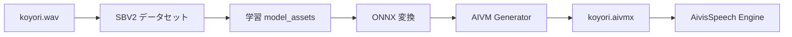

# koyori ref_wav → Aivis AIVMX（実験トラック）

**状態**: 💤 **一時停止**（2026-07-10）— SBV2 学習パイプラインを試したが **品質不足**。関西弁イントネーション実験は当面あきらめ。本 doc は手順・venv トラブルシュートの **アーカイブ**。

**目的**（当時）: Irodori 本番の `koyori.wav` から Aivis 用カスタムモデル（`.aivmx`）を作り、定番句 `accent_phrases` POC の土台にする。

**結論**: 139s ref 1 本・標準語寄り書き起こし・Irodori 級 ref_wav 本番運用不可、では **実用に届かない**。プロ品質の Irodori を本番維持。再開条件 = 追加コーパス + 明確な品質目標が揃ったときのみ。

**前提**: Aivis は **推論時 ref_wav 非対応**。声質取り込み = **SBV2 学習 → AIVMX 変換 → Engine インストール**。

---

## 素材

| 項目 | 値 |
|---|---|
| 正本 | `C:\Users\ma\src\Irodori-TTS-Server\voices\koyori.wav` |
| 長さ | ~139s · stereo 44.1kHz |
| 前処理出力 | `.research/aivis-koyori/koyori_mono.wav`（mono） |

```powershell
.\scripts\prepare_koyori_sbv2_input.ps1
.\scripts\prepare_koyori_sbv2_input.ps1 -CopyToSbV2   # SBV2 導入後
```

**注意**: 2 分強は SBV2 的には **ギリギリ**。スライス + Whisper 書き起こし後、明瞭度・音量を目視確認。足りなければ追加録音。

---

## パイプライン概略



---

## Step 0 — SBV2 インストール（未導入）

```powershell
.\scripts\install-style-bert-vits2.ps1
```

**推奨**: [releases の sbv2.zip](https://github.com/litagin02/Style-Bert-VITS2/releases) → `C:\Users\ma\src\Style-Bert-VITS2` → **`Install-Style-Bert-VITS2.bat`（ルート）を最後まで**

### フォルダ構成（sbv2.zip 想定 — **二重が正しい**）

```
C:\Users\ma\src\Style-Bert-VITS2\          ← zip 展開ルート（Install*.bat はここ）
  Install-Style-Bert-VITS2.bat
  Setup-Python.bat
  lib\  python\
  Style-Bert-VITS2\                          ← git clone 先（App.bat は **ここ**）
    App.bat  app.py  requirements.txt
    venv\                                    ← venv も **ここ**
    input\
```

**App.bat を叩く場所**: `...\Style-Bert-VITS2\Style-Bert-VITS2\App.bat`  
ルートの `venv\`（あれば）は別物。使わない。

### `ModuleNotFoundError: gradio` 等

**原因**: `Install-Style-Bert-VITS2.bat` が **PyTorch までで止まった**（`requirements.txt` 未完了）。

**確認**（nested venv）:

```powershell
cd C:\Users\ma\src\Style-Bert-VITS2\Style-Bert-VITS2
.\venv\Scripts\pip.exe list | findstr gradio
```

無ければ nested で残りを入れる:

```powershell
cd C:\Users\ma\src\Style-Bert-VITS2\Style-Bert-VITS2
.\venv\Scripts\pip.exe install "gradio>=4.32"
.\venv\Scripts\python.exe -m uv pip install -r requirements.txt --python .\venv\Scripts\python.exe
```

`av` ビルドで落ちたら（Windows よくある）:

```powershell
.\venv\Scripts\pip.exe install "av>=12" --only-binary=:all:
# その後 faster-whisper 等を --no-deps で入れるか、Install bat を再実行
```

完了後:

```powershell
.\venv\Scripts\python.exe initialize.py
```

### `TimeoutError: サーバーに接続できませんでした`（pyopenjtalk worker）

**原因**: 裏で起動する pyopenjtalk worker が即死。よくあるのは **numpy 2.x** と **setuptools 83**（`pkg_resources` 欠落）。

**nested venv で修正**:

```powershell
cd C:\Users\ma\src\Style-Bert-VITS2\Style-Bert-VITS2
.\venv\Scripts\pip.exe install "setuptools<81" "numpy<2"
.\venv\Scripts\pip.exe install --force-reinstall --no-deps pyopenjtalk-dict==0.3.4.dev2
.\venv\Scripts\python.exe -c "import pyopenjtalk; print('ok')"
```

その後 `App.bat` 再実行。

### 文字起こし `No module named 'ctranslate2'`

faster-whisper の依存が `--no-deps` インストールで欠けている場合:

```powershell
cd C:\Users\ma\src\Style-Bert-VITS2\Style-Bert-VITS2
.\venv\Scripts\pip.exe install "ctranslate2<4,>=3.22" "tokenizers<0.16,>=0.13"
.\venv\Scripts\python.exe -c "from faster_whisper import WhisperModel; print('ok')"
```

WebUI の **音声の文字起こし** を再実行。

### 書き起こし前処理 `text_error.log` — `is_offline_mode`

**原因**: `transformers 5.x` + `gradio 6.x` が入って `huggingface_hub` が壊れた（SBV2 は **transformers 4.x + gradio 4.x + hub 0.36** 想定）。

**nested venv で整合**:

```powershell
cd C:\Users\ma\src\Style-Bert-VITS2\Style-Bert-VITS2
.\venv\Scripts\pip.exe uninstall -y transformers gradio gradio-client
.\venv\Scripts\pip.exe install "transformers==4.44.2" "huggingface_hub==0.36.2" "gradio==4.44.1" "setuptools<81" "numpy<2"
.\venv\Scripts\pip.exe install "ctranslate2<4,>=3.22" faster-whisper==0.10.1
```

WebUI を **再起動**して **Step 3 自動前処理** を再実行。  
ログ: `Data/koyori/text_error.log`（23行全部同じなら上記が原因）。

`Audio not found: koyori_mono-N.wav` が出たら、WAV が `Data/koyori/wavs/` にあるか・ファイル名が list と一致するかを確認。

### App.bat — UI が真っ白 / `TypeError: argument of type 'bool' is not iterable`

**原因**: `gradio-client 1.3.x` が Pydantic 2.11+ の JSON schema（`additionalProperties: true/false` が bool）を解釈できない。  
`pip install gradio` だけだと **pydantic 2.13** や **starlette 1.x** も一緒に上がりやすい。

**nested venv で整合**（前処理用 stack + WebUI 用 pin）:

```powershell
cd C:\Users\ma\src\Style-Bert-VITS2\Style-Bert-VITS2
.\venv\Scripts\pip.exe install `
  "transformers==4.44.2" "huggingface_hub==0.36.2" `
  "gradio==4.44.1" "gradio-client==1.3.0" `
  "pydantic==2.10.6" "pydantic-core==2.27.2" `
  "starlette==0.41.3" "fastapi==0.115.6" `
  "setuptools<81" "numpy<2"
```

`gradio-client` 1.3.0 単体では bool schema が直らない場合、`venv\Lib\site-packages\gradio_client\utils.py` の `get_type` / `_json_schema_to_python_type` に bool 対応パッチが必要（Gradio 4.44 系の既知 workaround）。

### App.bat — `TypeError: unhashable type: 'dict'`（jinja2）

**原因**: **starlette 1.0+** が `TemplateResponse(name, context)` 旧 API を削除。gradio 4.44 は旧 API 前提。

上の **`starlette==0.41.3`** pin で解消。`fastapi 0.139` 単体では starlette 1.x が入るので **fastapi も 0.115 系に下げる**。

### App.bat — `ValueError: When localhost is not accessible`

多くは上記 UI 例外の連鎖（ブラウザが `/` を取れず localhost チェック失敗）。stack 修正後に **App.bat 再起動**。  
7860/7861 が Irodori 等で埋まっていると別ポート（7862）になる — URL ログを確認。

**VRAM**: RTX 3090 なら batch 4 前後が目安。Irodori と **同時常駐しない**（Linksee: VRAM 競合）。

---

## Step 1 — データセット作成（WebUI）

1. `App.bat` 起動
2. **データセット作成** タブ
3. モデル名: `koyori`
4. `input/koyori.wav`（mono 前処理済み）を配置
5. **スライス実行** → **書き起こし**（Whisper 自動）
6. 生成された `.list` / テキストを目視修正（大阪弁・誤認識）

---

## Step 2 — 学習

1. **学習** タブ · モデル名 `koyori`
2. **自動前処理を実行**
3. **学習を開始**（epoch はまず 50–100 で様子見）
4. 成果物: `Style-Bert-VITS2/model_assets/koyori/`

---

## Step 3 — ONNX → AIVMX

1. SBV2 WebUI または CLI で **ONNX エクスポート**（model_assets 配下）
2. [AIVM Generator](https://aivm-generator.aivis-project.com/) を開く（Aivis Engine 起動推奨）
3. ONNX / model_assets を指定
4. メタデータ: 名前 `koyori`、制作者、ライセンス（非公開なら ACML-NC 等）
5. **AIVMX 生成** → ダウンロード

---

## Step 4 — Aivis にインストール

1. AivisSpeech / Engine 起動（`:10101`）
2. 設定 → **音声合成モデルの管理** → インストール
3. `koyori.aivmx` を選択
4. `/speakers` API で新 **style ID** を確認

```powershell
Invoke-RestMethod http://127.0.0.1:10101/speakers | ConvertTo-Json -Depth 6
```

5. `tts-mcp/.env` に `VOICEVOX_SPEAKER=<新ID>`（実験時のみ `TTS_DEFAULT_ENGINE=voicevox`）

---

## Step 5 — 定番句アクセント POC

- 辞書: `presets/koyori-osaka-accent-phrases.yaml`
- `audio_query` → `accent_phrases` 上書き → `synthesis`（未配線 · 次フェーズ）

---

## 期待と限界

| 期待 | 現実 |
|---|---|
| Irodori と同じ ref 1 本で即クローン | ❌ 学習 + 変換が必要 |
| 139s だけで高品質 | △ POC 程度。本番品質は追加コーパス推奨 |
| アクセント完全制御 | △ モデル内蔵 + `accent_phrases` で部分上書き |

**本番 Irodori は維持**。AIVMX は ~~アクセント実験用フォールバック~~ → **2026-07-10 時点で見送り**（[osaka-accent-intonation.md](./osaka-accent-intonation.md) と同時停止）。

---

## 関連

- [osaka-accent-intonation.md](./osaka-accent-intonation.md)
- [irodori-tts-API-for-Python.md](../irodori-tts-API-for-Python.md)
- [Aivis SBV2 → AIVMX 公式 note](https://note.com/aivis_project/n/nd689f3f45dae)
