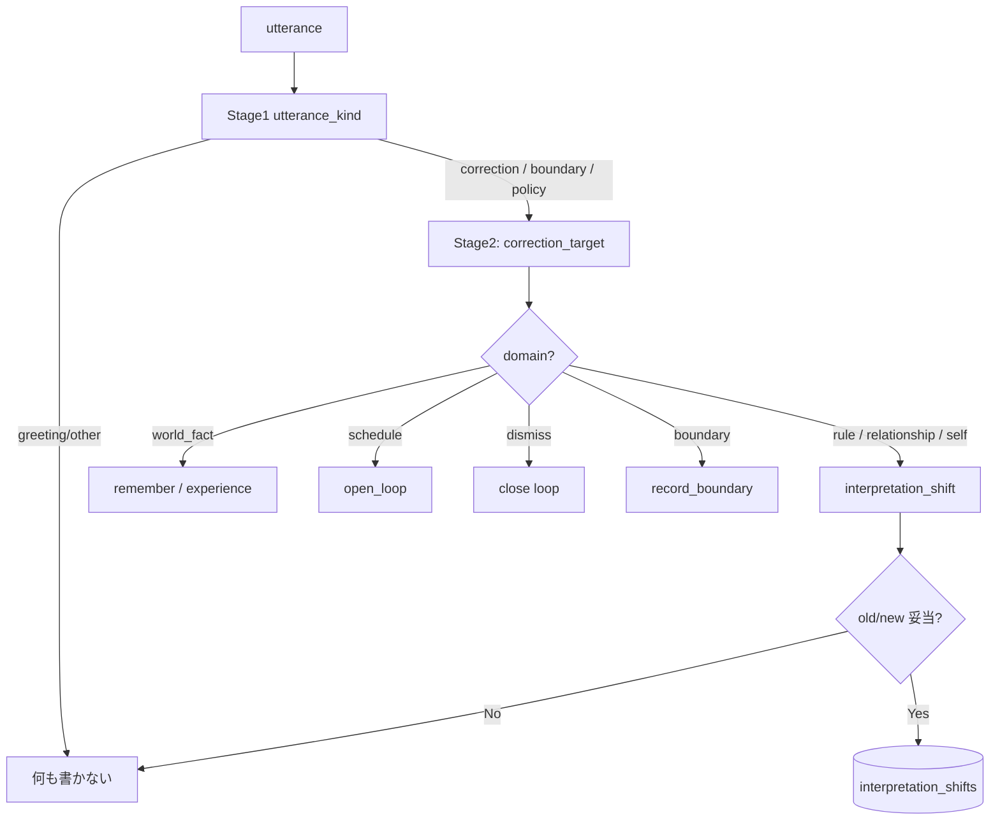

# interpretation_shift — 追記条件とルーティング

**状態**: 📋 SHIFT-R1 ✅（legacy hook off when routing on）· **SHIFT-R2 ✅**（要 flag）· SHIFT-R3 📋  
**きっかけ**: 2026-06-23「違うみたい。松本市のホームページに無いかな？」が `interpretation_shift` に誤記録された  
**関連**: [utterance-anchoring.md](./utterance-anchoring.md)（Stage 2 増設ルール · TEMP-4 ✅）· [cognitive-layers.md](../architecture/cognitive-layers.md) · [heartbeat-loop.md](../architecture/heartbeat-loop.md)（BIO-7）· [mem-pipeline.md](../architecture/mem-pipeline.md)

---

## Stage 2 増設（共通ルール）

SHIFT-R2（理解更新用 Stage 2）は [utterance-anchoring.md § Stage 2 を増やす判断ルール](./utterance-anchoring.md#stage-2-を増やす判断ルール) に従う。  
要約: Stage 1 kind からだけ起動 · schema 固定 · Stage 3 でルーティング · 表層 KV に載せない。

---

## 実装順（合意）

```
① TEMP-4 ✅ — plan.must_include から shift 全文 hold を外す · **幽霊経路**の schedule 禁止（open_loops は挨拶可 — [utterance-anchoring.md § 朝の挨拶](./utterance-anchoring.md#朝の挨拶--幽霊禁止-vs-open_loops合意-2026-06-29)）
② SHIFT-R1 ✅ — `PRESENCE_GW_CORRECTION_ROUTING=1` 時 post-reply regex shift 停止
③ SHIFT-R2 ✅ — Stage1 `correction` → correction_target Stage2 → store ルーティング
④ SHIFT-R3 📋 — `interpretation_shifts.domain` 列 + inject filter
```

**有効化**（`~/.config/embodied-claude/presence-ui.local.env` · STAGED と併用）:

```env
PRESENCE_GW_S2_ENABLED=1
PRESENCE_GW_S2_STAGED=1
PRESENCE_GW_CORRECTION_ROUTING=1
```

`restart-presence-ui.ps1` で反映。

---

## 問題の本質

いまの BIO-7 フック（`presence_ui/heartbeat/interpretation_shift.py`）は **「訂正 cue があれば shift」** という十分条件だけ。

```python
def infer_interpretation_shifts(...):
    """Heuristic v1 — user correction cues and boundary hints."""
    ...
    has_cue = bool(_CORRECTION_CUE.search(user))
    if not has_cue:
        return []
```

README / schema が言っているのは別物:

> how it interprets a **rule, a relationship, or a self-model**

松本市HPの件は **世界事実の訂正** であって、**エージェントの解釈モデルの更新** ではない。DB に入るべき行ではなかった。

[cognitive-layers.md](../architecture/cognitive-layers.md) の方針とも矛盾する — **「間違えると DB が汚れる」系は表層 LLM にも単純 regex にも賭けない**。

---

## 先に決めるべきこと: shift の「仕事」

shift が守っている不変条件はこれ:

> **以降のターンで、エージェントが「古い解釈」に戻ってはいけない**

plan が `must_include` で使うのもそのため（`interaction_orchestrator_mcp/plan.py`）:

```text
interpretation shift on '{topic}': do NOT revert to
「{old_interpretation}」 — hold 「{new_interpretation}」
```

つまり DB 追記の判断基準は **キーワード** ではなく:

**「この old→new は、将来の振る舞い・関係・自己理解を変えるか？」**

---

## 追記のための必要条件（案）

全部満たすときだけ `interpretation_shifts` へ、という形がよさそう。

| # | 条件 | 松本市HP | 「夜は静かに」 |
|---|------|----------|----------------|
| 1 | **対象 domain** が `rule / relationship / self_model / boundary` のいずれか | ✗（world_fact） | ✓（boundary） |
| 2 | **old/new が「エージェントの解釈」** を述べる（事実・予定・場所ではない） | ✗ | ✓ |
| 3 | **将来ターンに効く**（一回限りの fact check ではない） | ✗ | ✓ |
| 4 | **正規化された topic** がある（生発話 80 字切り捨てではない） | ✗ | ✓ `quiet hours` 等 |
| 5 | **根拠** が残る（source utterance_id / trigger kind / confidence） | — | — |

4 が重要。**topic = user_text[:80]** は「何についての解釈更新か」が定義されておらず、plan が全文 hold する爆弾になる。

---

## ルーティング表（shift 以外へ逃がす）

追記条件を考える前に、**そもそも別テーブル行き** を決める。

| まーの発話の意味 | 行き先 | shift しない理由 |
|------------------|--------|------------------|
| 事実訂正（HP に無い、天気違う） | `remember` / experience / 検索結果 | 世界状態の更新 |
| 予定・タスク | open_loop（TEMP-C `events[]`） | スケジュールは OL/GAPI 管轄 |
| 「もう忘れていい」 | close loop / STM 降格 | dismiss、解釈更新ではない |
| 境界・同意 | `record_boundary` | 専用 schema がある |
| 関係性の距離感 | shift **または** person_model 更新 | domain 次第 |
| 方針・ルール（深夜 nudge 等） | shift + policy | まさに shift の本丸 |

「違う」は **ルーティング cue** にはなるが、**destination 決定 cue にはならない**。

---

## 判定パイプライン（キーワード修正ではない）

TEMP-C と同型の **段階分類 + ルーティング** が筋がいい。



Stage 2 で欲しいフィールド例:

```json
{
  "correction_target": "world_fact | schedule | dismiss_topic | agent_behavior | boundary | relationship",
  "persists_across_turns": true,
  "canonical_topic": "quiet hours and presence",
  "old_interpretation": "May nudge during late evening",
  "new_interpretation": "Do not speak after quiet hours unless asked",
  "confidence": 0.85
}
```

**G1 同様**: Stage 1 が `greeting` / 単なる雑談なら Stage 2 禁止。

---

## 追記トリガーの候補（比較）

| 方式 | メリット | デメリット |
|------|----------|------------|
| A. 現状 regex cue | 実装済・速い | 誤検知多い（松本市HP 等） |
| B. cue 削除 + **明示 MCP のみ** | DB 汚染ゼロ | ほとんど記録されない |
| C. **plan が shift 要否を返す** | compose 文脈を見れる | plan 実装依存 |
| D. **Stage2 分類 → ルーティング** | 一貫（TEMP-C と同じ思想） | POC→本番コスト |
| E. boundary 系だけ regex、他は D | 段階的 | 二重メンテ |

**おすすめ**: **短期 E → 中期 D**

1. **短期**: gateway 自動 shift を **止める or boundary 専用に縮小**（blast radius 削減）
2. **TEMP-4**: plan が shift 全文 hold しない（[utterance-anchoring.md](./utterance-anchoring.md)）
3. **中期**: TEMP-C パイプに `correction_target` Stage を足し、**ルーティング先を決めてから** shift 書き込み

「違うを blacklist に追加」だけは **A の延長** で、D に行くまでの暫定には使わない方がよい。

---

## 受け入れ条件（spec として書ける粒度）

実装前に満たすべきシナリオ:

1. 「違うみたい。松本市のHPに無いかな？」→ **shift 0 件**、remember or experience のみ可
2. 「夜は静かにして」→ **boundary 記録**、shift は canonical topic 付きで最大 1 件
3. 「今日入浴介助…角煮…」→ **open_loop**、shift 禁止
4. 「松本市HPの話は忘れていい」→ **loop close**、shift 禁止
5. compose/plan で **world_fact 系 shift が inject されない**（念のため domain 列でも filter）

---

## 実装 ID（予定）

| ID | 内容 | 依存 |
|----|------|------|
| **SHIFT-R0** | 本 doc · 必要条件 · ルーティング表 · 受け入れ | — |
| **SHIFT-R1** | gateway post-reply regex shift 停止（routing on 時） | ✅ `legacy_shift_hook_enabled` |
| **SHIFT-R2** | Stage1 `correction` → correction_target Stage2 → store ルーティング | ✅ `correction_routing.py` |
| **SHIFT-R3** | `interpretation_shifts.domain` 列 + inject filter | migration |

---

## まとめ

- 改善は必要。**ただし「どの cue で」ではなく「どの domain に書くか」から**。
- `interpretation_shift` は **振る舞い・関係・自己モデルの回帰防止** 専用。
- 事実訂正・予定・話題 dismiss は **別 store** — ここを決めないと keyword いじりが永遠に続く。
- **実装の第一歩は TEMP-4**（plan hold 整理）。追記条件の本実装（SHIFT-R1/R2）はその後。

---

## 参照コード（現状）

| 箇所 | 役割 |
|------|------|
| `presence-ui/src/presence_ui/gateway/correction_routing.py` | SHIFT-R2 Stage2 + Stage3 ルーティング |
| `presence-ui/src/presence_ui/heartbeat/interpretation_shift.py` | BIO-7 legacy hook（routing on 時は no-op） |
| `interaction-orchestrator-mcp/.../plan.py` | shift → `must_include`（TEMP-4 対象） |
| `interaction-orchestrator-mcp/.../shift_temporal.py` | inject 時 stale / relativize（TEMP-2/3） |
| `scripts/cleanup-social-garbage.py` | 既知ノイズ shift の手動削除 |
