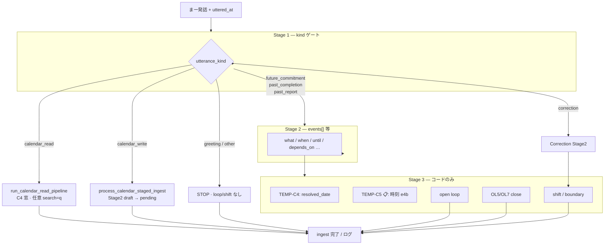
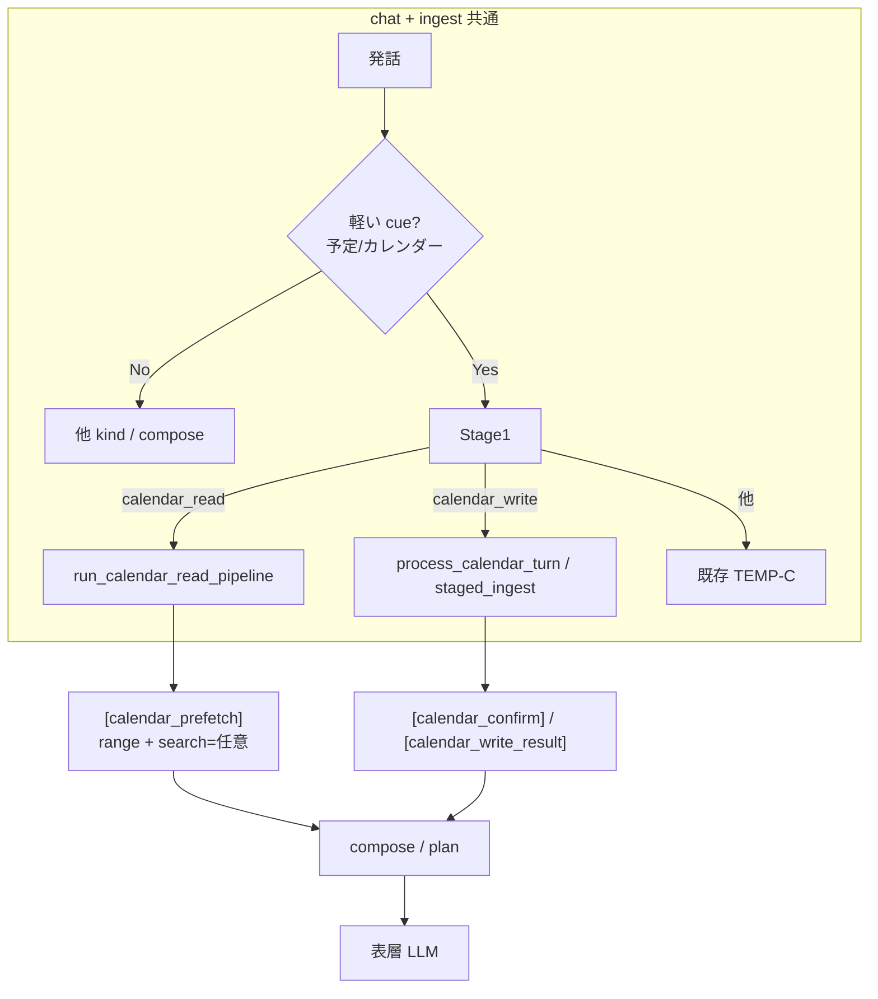

# TEMP-C — 各 Stage のルート図

**状態**: 参照用（実装: `presence-ui/src/presence_ui/gateway/temp_c_staged.py`）  
**関連**: [utterance-anchoring.md](./utterance-anchoring.md) · [stage1-loop-routing.md](./stage1-loop-routing.md) · [gapi.md](./gapi.md) · [cognitive-layers.md](../architecture/cognitive-layers.md)

有効化: `PRESENCE_GW_S2_STAGED=1`（ma-home: `~/.config/embodied-claude/presence-ui.local.env`）

Classifier: 既定 Gemma 4 12B QAT / カレンダー窓・時刻は e4b（TEMP-C5 / GAPI-2r-S2）

---

## カレンダー読み / 書き（GAPI-2r-S2 · GAPI-2w 完了）

| | **読み** | **書き** |
|---|----------|----------|
| **chat** | cue → Stage1 `calendar_read` → `run_calendar_read_pipeline()` | cue → Stage1 `calendar_write` → `process_calendar_turn()`（7b confirm） |
| **ingest** | Stage1 `calendar_read` → 同一 pipeline | Stage1 `calendar_write` → `process_calendar_staged_ingest()` |
| **Stage2** | C4 窓 → e4b フォールバック（読取専用 e4b） | `events[]` / patch draft（既存 7b） |
| **Stage3** | `list_events` → `[calendar_prefetch]`（任意 `q=` 検索） | insert/patch → `[calendar_write_result]`（Confirm 後） |

`calendar_operation` は **廃止**。モデルが古い kind を返した場合のみ `stage1_calendar.py` で `calendar_read` / `calendar_write` に正規化。

実装詳細: [gapi.md § GAPI-2 拡張](./gapi.md#gapi-2-拡張--読取窓と-stage1-統合2026-07)

---

## 1. 全体（ingest · GW-S2）

room ingest → `run_staged_classify` → `apply_staged_decisions`



| Stage | 読み | 書き | OL 系 |
|-------|------|------|-------|
| **1** | `calendar_read` | `calendar_write` | 既存 7 kind |
| **2** | 窓（C4 → e4b）· キーワード（e4b 検索専用 → 鍵括弧 fallback · GAPI-2s） | `events[]` / 7b draft（既存） | `events[]` |
| **3** | API list · 副作用なし | API insert/patch · Confirm 後 | DB のみ |

---

## 2. Stage 1 kind → 下流ルート

```mermaid
flowchart LR
  FC[future_commitment] --> S2O[Stage2 → events[]]
  PC[past_completion] --> S2C[Stage2 → events[]]
  PR[past_report] --> S2R[Stage2 → events[]]
  GR[greeting] --> NIL[no loop]
  OT[other] --> NIL
  CO[correction] --> CR[correction Stage2]
  CREAD[calendar_read] --> RPIPE[read pipeline<br/>窓 + list API]
  CWRITE[calendar_write] --> W2[write Stage2 → draft]

  RPIPE --> PREF[prefetch block]
  W2 --> W3[confirm → write API]
  S2O --> OLopen[open loop]
  S2C --> OLclose[OL5/OL7]
```

| kind | route | 備考 |
|------|-------|------|
| `calendar_read` | GAPI read pipeline | chat / ingest 共通 |
| `calendar_write` | GAPI 7b confirm | chat / ingest 共通 · L0 regex なし |
| `calendar_operation` | — | **廃止**（正規化のみ） |
| 他 | 既存 | [stage1-loop-routing.md](./stage1-loop-routing.md) |

---

## 3. Stage 2 以降の分岐（ガード G1–G5）

```mermaid
flowchart TD
  A[Stage1 完了] --> G1{G1: greeting/other?}
  G1 -->|Yes| X[STOP]
  G1 -->|No| GCR{calendar_read?}
  GCR -->|Yes| RS2[read: C4 窓<br/>曖昧のみ e4b · 任意 q=]
  GCR -->|No| GCW{calendar_write?}
  GCW -->|Yes| WS2[write Stage2<br/>既存 7b 統合]
  GCW -->|No| Gcor{correction?}
  Gcor -->|Yes| CS2[correction Stage2]
  Gcor -->|No| G2{STAGE2_EVENTS_KINDS?}
  G2 -->|Yes| S2[events[] Stage2]
  G2 -->|No| X2[merge のみ]

  RS2 --> R3{ambiguous?}
  R3 -->|No| API[list_events → prefetch]
  R3 -->|Yes| CLARIFY[compose: 日付確認 · API なし]

  WS2 --> W3[pending / execute 7b]
  S2 --> S3[OL / anchor 既存]
```

| ID | ガード |
|----|--------|
| **G1** | `greeting` / `other` → Stage 2 禁止 |
| **G2** | kind allowlist のみ |
| **G3** | timeout + max_tokens |
| **G4** | events≤4 · read 窓は `max_prefetch_chars` |
| **G5** | 読み: **C4（`date_resolution`）→ e4b** の順。書き: Confirm 必須（[P→C→E](../architecture/llm-propose-confirm-execute.md)） |

---

## 4. chat と ingest の関係（統合済み）



| 経路 | トリガー | カレンダー |
|------|----------|------------|
| **chat 読** | cue → Stage1 `calendar_read` | `[calendar_prefetch]`（GAPI-2b 窓 · GAPI-2s `q=`） |
| **chat 書** | cue → Stage1 `calendar_write` | 7b confirm → `[calendar_write_result]` |
| **ingest 読** | Stage1 `calendar_read` | 同一 read pipeline（compose 注入なし） |
| **ingest 書** | Stage1 `calendar_write` | 同一 7b staged ingest |

**削除済み（GAPI-2w）**: chat L0 `detect_calendar_write_intent` 即時書込み · ingest 先行 L0 write · `calendar_operation` 分岐。

注入タイミング: chat は compose 前 · ingest はログのみ。

---

## コード入口

| ファイル | 役割 |
|----------|------|
| `temp_c_staged.py` | staged classify · `calendar_read` / `calendar_write` 分岐 |
| `ol_gate_prompts.py` | Q1a read / Q1b write |
| `stage1_kinds.py` | `calendar_read` / `calendar_write`（`calendar_operation` なし） |
| `stage1_calendar.py` | legacy `calendar_operation` 正規化 |
| `calendar_read_flow.py` | `should_run_calendar_read` · `run_calendar_read_pipeline` |
| `calendar_read_window.py` | C4 → e4b 窓解決 |
| `calendar_read_search.py` | GAPI-2s · e4b `search_query` + 時制サニタイズ + 鍵括弧 fallback |
| `calendar_read_stage.py` | e4b 窓/検索 extract · `run_classifier_turn` |
| `gateway_turn_cache.py` | ターン内 Stage1 / prefetch 窓 / search e4b の重複抑止 |
| `gateway_llm_log.py` | e4b 分類ログ（`gateway-llm.log`） |
| `calendar_prefetch.py` | cue · prefetch ブロック整形 |
| `calendar_write_flow.py` | `should_run_calendar_write` · 7b confirm |
| `gapi/calendar_client.py` | `list_events_in_time_range(q=…)` |

---

## 関連トラック ID

| ID | 内容 | 状態 |
|----|------|------|
| TEMP-C1–C4 | Stage1/2 · OL anchor | ✅ |
| TEMP-C5 | clock when · e4b | 📋 |
| **GAPI-2b** | 発話窓 · `date_resolution` | ✅ |
| **GAPI-2r** | Stage1 `calendar_read` / `calendar_write` | ✅ |
| **GAPI-2r-S2** | read pipeline · chat/ingest 統合 · L0 read 削除 | ✅ |
| **GAPI-2w** | write を `calendar_write` に完全移行 · L0 write 削除 | ✅ |
| **GAPI-2s** | 読取キーワード検索（窓 + Google `q`） | ✅ |

LM Studio 手試し: [gapi.md § LM Studio POC](./gapi.md#lm-studio-poc--読取-stage2)
